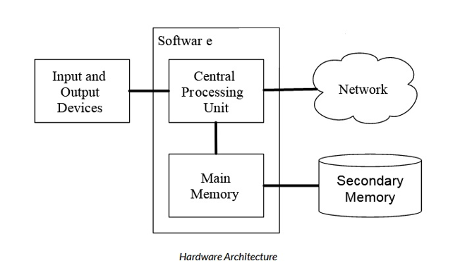

# CSE 5000 – Information to Information Technology  
## Lecture 2: Computer Hardware, OS, and Performance  
**Module:** Digital Infrastructure & Computing Foundations  
**Duration:** 1 hour 20 minutes  

---

## 1. Looking Inside the Computer Systems: Hardware
If we were to take apart our computer or cell phone and look deep inside, we would find the following parts: 

So we can say computer hardware devices fall into one of **four** categories:
1.	Processor
2.	Memory
3.	Input and output
4.	Storage (secondary memory)
### Processor
* **Processor** is like the brain of the computer. It organizes and carries instructions that come from either the user or the software. A personal computer processor usually consists of one or more specialised chips, called a microprocessor, which are slivers (splinters) of silicon or other material etched with many tiny electronic circuits. The term Central Processing Unit (or CPU) refers to a computer’s processor.
Every CPU includes the following **three** components (Control Unit, Arithmetic Logic Unit [ALU] and Registers):

  * The **Control Unit** manages the flow of data through the CPU. It directs data to and from the other components within the CPU.

  * **The Arithmetic Logic Unit (ALU)** component does the actual processing. It receives data and instructions and delivers a result. Because all computer data is stored as numbers, much of the processing involves comparing numbers or performing mathematical operations. In addition to establishing and changing ordered sequences, the computer can perform two types of operations: arithmetic and logical. Arithmetic operations include addition, subtraction, multiplication, and division. Logical operations include comparisons, such as determining whether one number is equal to, greater than, or less than another number. Also, every logical operation has an opposite. For example, in addition to “equal to” there is “not equal to.”
  * Many instructions carried out by the control unit involve simply moving data from one place to another—from memory to storage, from memory to the printer, and so forth. When the control unit encounters an instruction that involves arithmetic or logic, however, it passes that instruction to the second component of the CPU, the arithmetic logic unit, or ALU. The ALU actually performs the arithmetic and logical operations described earlier.
  * The ALU includes a group of **registers** which are high-speed memory locations built directly into the CPU that are used to hold the data currently being processed. Registers are holding areas for both data and instructions. We can think of the register as a scratchpad. The ALU will use the register to hold the data currently being used for a calculation. For example, the control unit might load two numbers from memory into the ALU's registers. Then it might tell the ALU to divide the two numbers (an arithmetic operation) or to see whether the numbers are equal (a logical operation). The answer to this calculation will be stored in another register before being sent out of the CPU. That means there are many different registers, each with its own special purpose.
  * **Multi-core CPU:** Most modern CPUs have multiple cores, so they can complete multiple tasks simultaneously, as if they were physically more than one CPU. A core consists of a separate set of essential processor components (control unit, ALU, and registers). Most Intel Core i7 (11th generation) processors typically have eight cores, for example. All the CPU’s cores are located on the same chip.
  * **Hyper-threading:** CPUs now also support hyper-threading which implements the concept **Simultaneous Multithreading (SMT)** Where a single core will present itself as multiple logical cores to a computer’s operating system.
  * Every microcomputer has a **system clock**. Like most modern wristwatches, the clock is driven by a quartz crystal. When electricity is applied, the molecules in the crystal vibrate millions of times per second. The computer uses the vibrations of the quartz in the system clock to time its processing operations. In theory, the CPU can execute a function on every tick of the system clock (a clock cycle). However, in practice, the CPU is sometimes idle because there is a delay between the request to retrieve data from memory and its delivery. A delay caused by waiting for another component to deliver data is called **latency**. The clock speed is measured in GHz. GHz is the number of operations a CPU can perform per second (in billions). 1.94 GHz = 1.94 billion operations per second.
  * To help minimize latency, CPUs have **caches**. A cache is a small amount of very fast memory located near (or within) the CPU. Data that the CPU has recently used or is predicted to need soon is placed in the cache for temporary storage. That way, if the CPU requests the data, it’s more readily available, with less delay.
   * Since the late 1980s, most PC CPUs have had cache memory built into them. This CPU-resident cache is often called the level-1 cache, or **L1 cache**.
   * To add even more speed to modern CPUs, an additional cache is added to CPUs. This cache is called Level-2 cache, or **L2 cache**. This cache used to be found on the motherboard. However, Intel and AMD found that placing the L2 cache on the CPU greatly increased CPU response. L2 cache is slower than L1 cache, but bigger in size.
   * In addition to the cache memory built into the CPU, cache is also added to the motherboard. This motherboard-resident cache is now called Level-3 cache or **L3 cache**. L3 cache is the largest cache memory unit, and also the slowest one.
   * L1, L2, and L3 all speed up the CPU, although in different ways. L1 cache holds instructions that the CPU core is currently using or will need immediately. L2 acts as a secondary, larger buffer to store data that couldn't fit in the L1 cache but is still likely to be needed soon. L3 serves as a "last resort" cache before hitting main memory (RAM). It is designed to hold larger datasets and shared data, minimizing the need to access the slow RAM. In all cases, the cache memory is faster for the CPU to access, resulting in quicker program execution.
     
  * **Virtualization** enabled in the CPU (often labeled as Intel VT-x or AMD-V in BIOS) allows a single physical processor to act as multiple, independent virtual CPUs. This crucial feature enables efficient running of virtual machines (VMs), emulators (like BlueStacks), containers (Docker), and security features like Windows Sandbox or Hyper-V, significantly enhancing resource utilization and flexibility. 

### Memory
* Memory is one or more sets of chips that store data and/or program instructions, either temporarily or permanently. PC use several different types of memory, but the two most important are called Main Memory or RAM and ROM.
 * **RAM:** The Main Memory or RAM (Random Access Memory) is used to store information that the CPU needs in a hurry.  RAM holds data and program instruction while while CPU works with them. When a program is launched it is loaded and run from memory. As program needs data, it is loaded into the memory for fast access. The main memory is nearly as fast as the CPU. But the information stored in the main memory vanishes when the computer is turned off. That’s why RAM is called volatile.
  * RAM has tremendous impact on the speed and power of a computer. Generally more 	RAM a computer has, the more it can do and the faster it can perform tasks. The most 	common measurement unit for describing a computer’s memory is the byte – the amount 	of memory it takes to store a single character such as a letter or a numeral. When 	referring to computer’s memory the numbers are often so large that it is helpful to use 	term such as kilobyte (KB), gigabyte (GB), and terabyte (TB) to describe the values.
 * **ROM:** Read-only Memory (ROM) stores its data permanently. It holds instructions that 	the computer needs to operate. Whenever the computer’s power is turned on, it checks 	ROM for directions that help it start up, and for information about its hardware device.

### Storage 
 * **The Secondary Memory or storage** is also used to store information, but it is much slower than the main memory. The advantage of the secondary memory is that it can store information even when there is no power to the computer. Examples of secondary memory or storage are Hard Disk Drive (HDD), solid-state drive (SSD) or flash memory.
 * We may think storage as **electronic file cabinet** and RAM as an **electronic worktable**. When data needed computer locates it in the file cabinet and puts a copy on the table. After finishing work it is put back into file cabinet.
 * **Comparison between storage and RAM** can be made in the following ways:
   * There is more in storage than in memory, just as there is more room in a file cabinet than there is on a tabletop
   * Contents are retained in storage when the computer is turned off, whereas program or the data in memory disappear when we shut down the computer.
   * Storage device operate much slower than memory chips, but storage is much cheaper than memory.
     
### Input and output
     
*	The **Input and Output Devices** are simply those that allow us to interact with the computer. Input devices accept data, for example: Keyboard, mouse. Output devices deliver data, for example: monitor, printer, and speaker. Some devices can both accept input and deliver output, for example: touch screens.
* These days, most computers also have a Network Connection to retrieve information over a network. We can think of the network as a very slow place to store and retrieve data that might not always be "up". So in a sense, the network is a slower and at times unreliable form of Secondary Memory.

## 2. Operating Systems & Virtualization
Modern business leaders do not write operating system code, but they make decisions every day that are shaped by how operating systems and virtualization work. A Chief Financial Officer negotiating a cloud migration deal, a COO designing a disaster recovery policy, or a startup founder choosing between AWS and Azure — all these decisions require a working understanding of the concepts covered in this session.

### What Is an Operating System?

### 2.1 The Manager of Your Computer

At its simplest, an **operating system (OS)** is the software that manages a computer's hardware and provides a platform for all other software to run. Without an OS, a computer is just expensive metal — it cannot interpret user commands, run applications, or communicate over a network.

> 💡 **Business Analogy:** Think of the OS as a hotel manager. The hotel (the computer hardware) has rooms (memory), staff (CPU), kitchens (storage), and doors (network interfaces). Every guest (application) wants resources. The hotel manager ensures that guests get what they need without interfering with each other, that staff aren't overworked, and that security protocols are respected.
>
> Every app on your phone — email, Slack, Excel — is a guest. iOS or Android is the hotel manager allocating battery, screen, and network access fairly among all apps.

### 2.2 Core Functions of an Operating System

An operating system performs six core functions that business professionals should understand:

| OS Function | What It Does | Business Relevance |
|---|---|---|
| **Process Management** | Runs multiple programs simultaneously by allocating CPU time | More processes = more productive users; poor management = slowdowns |
| **Memory Management** | Allocates RAM to applications; manages virtual memory | Insufficient RAM causes app crashes; over-provisioning wastes money |
| **File System Management** | Organises, stores, and retrieves data on disk | File system choice affects backup, recovery, and performance |
| **Device Management** | Coordinates peripherals: printers, storage, network cards | Compatibility affects hardware vendor flexibility |
| **Security & Access Control** | Enforces user permissions and system policies | Critical for compliance, data governance, and breach prevention |
| **Networking** | Manages network stack and communications | Determines how systems communicate and share data across the enterprise |

### 2.3 Types of Operating Systems

#### Desktop Operating Systems

Designed for individual users. Examples include **Windows 11**, **macOS**, and **Linux (Ubuntu Desktop)**. These power the PCs and laptops employees use every day.

#### Server Operating Systems

Optimised for running services, hosting databases, and serving web content to many users simultaneously. Examples include **Windows Server**, **Ubuntu Server**, **Red Hat Enterprise Linux (RHEL)**, and **CentOS**. These run in data centres.

#### Mobile Operating Systems

Lightweight, power-efficient OS for smartphones and tablets. **iOS** and **Android** dominate this space. Relevant for BYOD (Bring Your Own Device) policies and mobile app strategy. Android is the most widely used operating system in the world, because it powers: Smartphones, Tablets, Smart TVs and IoT devices.

#### Embedded Operating Systems

OS inside specialised devices: ATMs, manufacturing equipment, medical devices, POS terminals. Often invisible to users but critical to operations.

> 💡 **Strategic Insight:** A company standardising on Linux servers versus Windows Server is making a long-term strategic and financial decision — affecting licensing costs, support contracts, talent acquisition, and vendor lock-in.

### 2.4 Open Source vs. Proprietary Operating Systems

| Dimension | Open Source (e.g., Linux) | Proprietary (e.g., Windows) |
|---|---|---|
| **Licensing Cost** | Free or low-cost | Per-seat or per-server licensing fees |
| **Support** | Community + paid commercial (Red Hat, Canonical) | Vendor-backed (Microsoft) |
| **Customisability** | Highly customisable | Limited, controlled by vendor |
| **Vendor Lock-in Risk** | Lower | Higher |
| **Enterprise Adoption** | ~90% of cloud/server workloads | Dominant on desktops; common in enterprise apps |
| **Security Updates** | Community-driven, often faster | Scheduled patch cycles |

---

## 3. Practical Demo 1 — Exploring an OS via Terminal

> 🖥️ **Demo Objectives:** In this demonstration, the instructor will use a Linux terminal to illustrate key OS concepts in real time. This is not a coding exercise — the goal is to help students visualise what an OS is actually doing when it runs.

### Step 1: Check the OS and Hardware Identity

Run the following commands to identify the operating system and machine details:

```bash
# View OS version
cat /etc/os-release

# View CPU information
lscpu

# View total RAM
free -h

# View disk usage
df -h
```

> 💡 **What this shows:** Every server knows exactly what hardware it has and how it is being used. This is what your IT team monitors 24/7 in a production environment.

### Step 2: Observe Running Processes

The OS manages many processes simultaneously. Let's see them:

```bash
# List all running processes
ps aux

# Real-time process monitor (like Task Manager)
top

# Count how many processes are running
ps aux | wc -l
```

> 💡 **What this shows:** Even a freshly booted server runs 100+ background processes. These serve monitoring, security, scheduling, and networking functions. Understanding this helps justify the cost of adequate RAM.

### Step 3: User Permissions and Access Control

```bash
# Check current user
whoami

# List users on the system
cat /etc/passwd | cut -d: -f1

# View file permissions
ls -la /etc/

# Try to access a restricted file (will be denied)
cat /etc/shadow
```

> 💡 **Business Relevance:** This is the OS enforcing the **principle of least privilege** — the foundation of data security. Regulatory frameworks like GDPR, ISO 27001, and SOX require it.

### Step 4: Network Status

```bash
# View network interfaces and IP addresses
ip addr show

# View active network connections
ss -tuln

# Check connectivity
ping -c 4 google.com
```

---

**🗣️ Discussion Question (5 minutes):** Based on what you just saw — what would happen to an e-commerce business if the OS on their web server ran out of RAM? What business impacts would follow?

---

## 4. Introduction to Virtualization

### 4.1 The Problem Virtualization Solves

Before virtualization became mainstream in the early 2000s, organisations followed a *one application, one server* rule. A database server ran only the database. A web server ran only the web application. This approach was deeply wasteful:

- A typical physical server ran at only **5–15% of its capacity**.
- Server rooms consumed enormous amounts of electricity and cooling.
- Hardware failures took entire systems offline.
- Provisioning a new server could take **weeks** of procurement and setup.
- Scaling up meant buying more physical hardware — an expensive, slow process.

Virtualization solved all of these problems by **decoupling software from hardware**. It allows one physical machine to impersonate many separate computers simultaneously.

### 4.2 What Is Virtualization?

**Virtualization** is the process of creating a software-based (virtual) version of a physical resource — such as a server, storage device, or network — using a layer of software called a **hypervisor**.

The key insight is **abstraction**: the physical hardware is abstracted away, and multiple virtual environments can each believe they are operating on their own dedicated machine. Each Virtual Machine (VM) has its own:

- Virtual CPU (vCPU)
- Virtual RAM
- Virtual storage (disk image file)
- Virtual network card
- Its own complete operating system

> 💡 **Analogy:** Virtualization is like apartment buildings. A single piece of land (physical server) is divided into many self-contained apartments (VMs), each with its own front door, kitchen, and bathroom — but sharing the land and common infrastructure.

### 4.3 The Hypervisor: Heart of Virtualization

A **hypervisor** (also called a Virtual Machine Monitor or VMM) is the software that creates and manages virtual machines. There are two types:

| Feature | Type 1: Bare-Metal Hypervisor | Type 2: Hosted Hypervisor |
|---|---|---|
| **Installation** | Directly on physical hardware | On top of an existing OS |
| **Performance** | High — direct hardware access | Lower — extra OS layer adds overhead |
| **Use Case** | Enterprise data centres, cloud | Developer testing, personal use |
| **Examples** | VMware ESXi, Microsoft Hyper-V, Xen, KVM | VirtualBox, VMware Workstation, Parallels |
| **Who Uses It** | IT departments, cloud providers | Developers, students, IT labs |

Enterprise environments almost universally use **Type 1 hypervisors**. AWS, Microsoft Azure, and Google Cloud Platform are, at their core, massive Type 1 hypervisor farms that partition their physical hardware into virtual machines they rent to customers.

### 4.4 Benefits of Virtualization for Business

| Benefit | Description | Financial Impact |
|---|---|---|
| **Server Consolidation** | Run 10–20 VMs on one physical server | Reduces hardware costs by up to 80% |
| **Disaster Recovery** | VM snapshots and live migration enable rapid failover | Reduces RTO from days to minutes |
| **Cost Optimisation** | Right-size VMs; pay only for what you need | CapEx converted to manageable OpEx |
| **Speed of Deployment** | New VM deployed in minutes vs. weeks for physical | Faster time-to-market for new initiatives |
| **Testing & Development** | Spin up isolated test environments instantly | No risk to production systems |
| **Vendor Independence** | VMs are portable across compatible hypervisors | Reduces lock-in to specific hardware vendors |

---

## 5. Virtual Machines vs. Containers

### 5.1 The Evolution: From VMs to Containers

While VMs revolutionised IT infrastructure, they still carry overhead — each VM includes a full operating system, which can take gigabytes of storage and minutes to boot. A new paradigm emerged: **containers**.

Containers are a lightweight form of virtualisation that package only an application and its dependencies — not an entire operating system. Multiple containers share the host OS kernel, making them dramatically smaller and faster.

### 5.2 VM vs. Container: Head-to-Head Comparison

| Dimension | Virtual Machine | Container |
|---|---|---|
| **What it includes** | Full OS + app + dependencies | App + dependencies only (no OS) |
| **Size** | Gigabytes | Megabytes |
| **Startup time** | Minutes | Seconds (or milliseconds) |
| **Isolation** | Strong (separate OS) | Moderate (shared kernel) |
| **Portability** | Portable across compatible hypervisors | Highly portable: 'runs anywhere' |
| **Resource usage** | Higher overhead | Very lightweight |
| **Best for** | Full app isolation, legacy systems, multi-OS | Microservices, cloud-native apps, DevOps |
| **Popular tools** | VMware, Hyper-V, VirtualBox | Docker, Podman, containerd |
| **Orchestration** | VMware vSphere, cloud providers | Kubernetes (K8s) |

### 5.3 When to Choose VMs vs. Containers

#### Choose VMs when:

- You need full OS-level isolation for regulatory or security compliance.
- You are running legacy applications that cannot be containerised.
- Different workloads require different operating systems.
- You need strong isolation between untrusted tenants.

#### Choose Containers when:

- You are building or modernising cloud-native applications.
- You need rapid deployment and scaling (e.g., peak traffic management).
- Your development team uses DevOps or CI/CD pipelines.
- Your application follows a microservices architecture.

### 5.4 Kubernetes: Orchestrating Containers at Scale

As container usage grew, organisations needed a way to manage thousands of containers automatically — scaling them up during peak demand and down when demand drops. **Kubernetes (K8s)**, originally developed by Google and now open-source, became the industry standard for container orchestration.

From a business perspective, Kubernetes is the technology that makes cloud auto-scaling possible. When a retail website receives a traffic spike on Black Friday, Kubernetes automatically spins up additional containers to handle the load, then removes them when traffic normalises — you only pay for what you use.

> 💡 **Business Takeaway:** Kubernetes is why cloud applications can scale from 10 to 10 million users without requiring a human to manually provision servers. It is the operational backbone of Netflix, Spotify, Uber, and most digital-native businesses.

---

## 6. Practical Demo 2 — Launching a VM in the Cloud (AWS/Azure)

> 🖥️ **Demo Objectives:** In this demonstration, the instructor will launch a Virtual Machine on a cloud platform (AWS EC2 or Azure Virtual Machines) in real time, illustrating how virtualization is the engine behind cloud computing.

### Part A: Launching an EC2 Instance on AWS

#### Step 1: Navigate to the AWS Console

1. Log in to the AWS Management Console at [console.aws.amazon.com](https://console.aws.amazon.com)
2. Search for **EC2** in the search bar and open the EC2 Dashboard.
3. Click **'Launch Instance'**.

#### Step 2: Configure the Virtual Machine

1. **Name:** `MyMBADemoServer`
2. **AMI (OS):** Select `Ubuntu Server 22.04 LTS (Free Tier eligible)`
3. **Instance Type:** `t2.micro` (1 vCPU, 1 GB RAM) — Free Tier
4. **Key pair:** Create a new key pair, download the `.pem` file
5. **Network settings:** Allow SSH (port 22) from `My IP`
6. **Storage:** 8 GB gp2 (default)
7. Click **'Launch Instance'**

> 💡 **Instructor note:** Point out that what just happened in 60 seconds would have taken 2–3 weeks in 2005 — ordering, shipping, racking, and configuring a physical server. This is the business value of virtualization.

#### Step 3: Connect to the VM and Explore

```bash
# Connect via SSH (replace with your key and IP)
ssh -i MyMBADemoKey.pem ubuntu@<public-ip-address>

# Confirm OS and specs
cat /etc/os-release
nproc          # Number of virtual CPUs
free -h        # Virtual RAM
df -h          # Virtual storage

# Check if this is running in a VM (it will show 'xen' or 'kvm')
systemd-detect-virt

# Install a web server in seconds
sudo apt update && sudo apt install -y nginx
sudo systemctl start nginx
```

> 💡 **What to point out:** The command `systemd-detect-virt` reveals that this Ubuntu machine *knows* it is running inside a virtual machine on Amazon's physical hardware. The abstraction is visible but thin — the OS can detect it.

### Part B: Understanding the Cloud Cost Model

| Instance Type | vCPU | RAM | Approx. Monthly Cost (On-Demand) |
|---|---|---|---|
| `t2.micro` (Free Tier) | 1 | 1 GB | Free (750 hrs/month) |
| `t3.medium` | 2 | 4 GB | ~$30–40/month |
| `m5.large` | 2 | 8 GB | ~$70–80/month |
| `m5.4xlarge` | 16 | 64 GB | ~$550–600/month |
| `c5.18xlarge` | 72 | 144 GB | ~$2,400/month |

Notice that you can provision a 72-vCPU, 144 GB RAM server in minutes and pay only for the hours you use it. This elasticity is the defining commercial advantage of cloud computing — and virtualization is what makes it possible.

#### Step 4: Terminate the Instance (Important!)

```bash
# Always terminate demo instances to avoid charges
# In the AWS Console:
# EC2 Dashboard > Instances > Select Instance > Instance State > Terminate Instance

# Alternatively from CLI:
aws ec2 terminate-instances --instance-ids i-XXXXXXXXXXXXXXXXX
```

---

**🗣️ Discussion (5 minutes):** If your company currently owns 50 physical servers, all running at 12% capacity, how would you make the business case to migrate to a virtualised or cloud environment? What data would you need? Who are the stakeholders you'd need to convince?

---

## 7. Virtualization, Cloud Computing & Business Strategy

### 7.1 The Cloud = Virtualization at Scale

It is impossible to understand cloud computing without understanding virtualization. Every major cloud platform — AWS, Microsoft Azure, Google Cloud Platform (GCP) — is fundamentally a global network of data centres running hypervisors that carve physical hardware into virtual machines rented to customers.

| Cloud Service | What It Is | Virtualisation Layer |
|---|---|---|
| **AWS EC2** | Virtual machine rental | KVM-based hypervisor + Nitro System |
| **Azure Virtual Machines** | Virtual machine rental | Hyper-V based hypervisor |
| **AWS Lambda / Azure Functions** | Serverless compute | Micro-VMs (Firecracker) or containers |
| **AWS ECS / AKS / GKE** | Managed container orchestration | Kubernetes on VMs |
| **AWS RDS / Azure SQL** | Managed database service | VMs with managed DB software |
| **AWS S3 / Azure Blob Storage** | Object storage | Virtualised, distributed storage |

### 7.2 CapEx to OpEx: The Financial Transformation

Virtualisation enabled one of the most significant financial model shifts in enterprise IT history — the move from **Capital Expenditure (CapEx)** to **Operational Expenditure (OpEx)**.

| Model | Traditional (Physical Servers) | Virtualised / Cloud |
|---|---|---|
| **Cost Type** | Capital Expenditure (CapEx) | Operational Expenditure (OpEx) |
| **Investment** | Large upfront hardware purchase | Pay-per-use, monthly billing |
| **Depreciation** | Hardware depreciates over 3–5 years | No depreciation — always latest hardware |
| **Flexibility** | Fixed capacity | Elastic: scale up/down instantly |
| **Risk** | Over/under-provisioning risk | Matched to actual demand |
| **Speed** | Weeks to provision new capacity | Minutes to provision |

> 💡 **CFO Perspective:** Moving from CapEx to OpEx through virtualisation can unlock significant cash flow, improve balance sheet flexibility, and shift IT from a fixed cost centre to a variable cost model aligned with business activity.

### 7.3 Key Strategic Questions for Business Leaders

#### On Operating System Strategy:

- Are we standardising on Windows or Linux server infrastructure? What are the licensing implications over a 5-year horizon?
- Do we have the internal talent to manage open-source Linux systems, or do we need commercial support contracts?
- Are our applications OS-agnostic, or are we locked into a specific OS?

#### On Virtualisation & Cloud:

- What percentage of our workloads are virtualised? What is the utilisation rate of our physical servers?
- Have we conducted a Total Cost of Ownership (TCO) analysis comparing on-premises virtualisation with cloud migration?
- Do we have a multi-cloud or hybrid cloud strategy to avoid vendor lock-in?
- Are our disaster recovery plans leveraging VM snapshots and automated failover?

#### On Containers:

- Is our development team building containerised applications? Are they using Docker and Kubernetes?
- Do we have a Kubernetes management strategy — self-managed, or managed service (EKS, AKS, GKE)?
- How does our container strategy align with our CI/CD pipeline and DevOps maturity?

---

## 8. Emerging Trends & Future Directions

### 8.1 Serverless Computing

Serverless computing is the next level of abstraction above containers. In a serverless model, developers write individual functions, and the cloud provider automatically manages the underlying VMs and containers. **AWS Lambda**, **Azure Functions**, and **Google Cloud Functions** are the leading services.

The term 'serverless' is a misnomer — servers absolutely still exist, but you never see or manage them. You pay only for the **milliseconds** your function runs. For business leaders, serverless represents the ultimate OpEx model: zero idle cost.

### 8.2 Edge Computing

As IoT, autonomous vehicles, and real-time analytics grow, there is increasing need to process data closer to where it is generated — at the 'edge' of the network rather than in a central data centre. This means VMs and containers are being deployed on smaller devices in factories, retail stores, vehicles, and hospitals.

### 8.3 Desktop Virtualisation (VDI)

Virtual Desktop Infrastructure allows employees to access a full desktop environment remotely from any device. Their desktop runs as a VM in a data centre, not on their physical laptop. This became especially relevant during the COVID-19 pandemic for remote workforces. Examples: **Citrix Virtual Apps**, **Azure Virtual Desktop**, **Amazon WorkSpaces**.

### 8.4 GPU Virtualisation for AI/ML Workloads

Artificial intelligence and machine learning require massive computational power, particularly from Graphics Processing Units (GPUs). GPU virtualisation allows multiple users to share a single high-end GPU, making AI infrastructure more cost-effective. AWS P4/P5 instances, Azure NC-series, and Google's TPU VMs are built around this concept.

### 8.5 FinOps: Managing Cloud Costs

As cloud spending grows, a new discipline called **FinOps** (Cloud Financial Operations) has emerged. FinOps teams are responsible for optimising cloud spend — analysing VM utilisation, rightsizing instances, using reserved or spot pricing, and eliminating wasted resources. For MBAs, this is an increasingly relevant career domain where business and technology meet directly.

---


## 10. Performance: CPU, OS, Virtualization & Real-World Troubleshooting

### 10.1 What Do We Mean by "Performance"?

In computing, **performance** refers to how efficiently a system uses its resources — CPU, memory, storage, and network — to complete tasks in acceptable time. Poor performance has direct business consequences: frustrated employees, slow customer-facing applications, missed SLAs, and lost revenue.

Performance is never caused by a single factor. It is always the result of an interaction between hardware capacity, OS efficiency, running workloads, and — in virtualised environments — the hypervisor layer sitting between software and physical hardware.

---

### 10.2 Factors Affecting CPU Performance

The CPU (Central Processing Unit) is the brain of the computer. Its performance determines how fast instructions are executed.

| Factor | Description | Business Impact |
|---|---|---|
| **Clock Speed (GHz)** | How many instruction cycles the CPU completes per second | Higher GHz = faster single-threaded tasks (e.g., spreadsheets, legacy apps) |
| **Number of Cores** | Physical processing units within a single CPU chip | More cores = better multitasking and parallel workloads (e.g., databases, rendering) |
| **Threads (Hyper-Threading)** | Virtual cores that allow one physical core to handle two instruction streams | Increases throughput under concurrent workloads |
| **CPU Cache (L1/L2/L3)** | Small, ultra-fast memory built into the CPU | Larger cache = fewer slow round-trips to RAM |
| **Thermal Throttling** | CPU automatically slows down when it overheats | Sustained throttling indicates cooling or ventilation problems |
| **CPU Utilisation %** | Percentage of CPU capacity in use at any moment | Sustained utilisation above 80–90% signals a bottleneck |
| **Process Priority** | OS assigns priority levels to processes | Misconfigured priorities can starve critical processes of CPU time |

> 💡 **Key insight:** A CPU running at 100% is not inherently bad — it means the system is being fully utilised. The problem arises when it is *sustained* at 100%, causing queuing delays for other processes. In cloud environments, CPU credits (AWS T-class instances) can silently throttle your workload when exhausted.

---

### 10.3 Factors Affecting OS-Level Performance

Even with powerful hardware, operating system configuration and state can severely degrade performance.

| Factor | Description | Impact |
|---|---|---|
| **Running Processes** | Number and weight of active processes | Too many background processes consume CPU and RAM unnecessarily |
| **Memory (RAM) Pressure** | When RAM is full, OS uses disk as virtual memory (swap) | Disk-based swap is 100x–1000x slower than RAM — causes severe slowdowns |
| **Disk I/O** | Speed at which data is read from/written to storage | HDD vs. SSD is the single largest real-world performance gap for most users |
| **File System Fragmentation** | Data scattered across disk in non-contiguous blocks | Mainly affects HDDs; SSDs are largely immune |
| **Driver Issues** | Outdated or corrupt hardware drivers | Can cause device failures, memory leaks, and system instability |
| **Scheduled Tasks & Updates** | Background OS updates, indexing, antivirus scans | Often silently consume CPU and disk during working hours |
| **Memory Leaks** | Poorly written applications that consume RAM over time without releasing it | Causes progressive slowdown; requires app restart or system reboot |
| **Startup Programs** | Applications configured to launch at boot | Extend boot time and consume resources even when not actively used |
| **OS Bloat** | Accumulation of unused software, temp files, and registry entries over time | Gradually degrades system responsiveness |
| **Kernel Scheduling** | How the OS allocates CPU time across competing processes | Poor scheduling configuration can starve interactive tasks |

---

### 10.4 Factors Affecting Performance in Virtualised Environments

Virtualisation adds an additional layer — the hypervisor — between the application and the hardware. This introduces unique performance considerations that do not exist on physical machines.

| Factor | Description | Impact |
|---|---|---|
| **vCPU Over-commitment** | More vCPUs allocated across VMs than physical cores exist | CPU contention: VMs queue for physical cores, causing latency spikes |
| **RAM Over-commitment** | Total RAM allocated to VMs exceeds physical RAM | Hypervisor uses ballooning or swapping — major performance penalty |
| **VM Density** | Number of VMs per physical host | Too many VMs on one host leads to resource starvation ("noisy neighbour" problem) |
| **Noisy Neighbour** | One VM consuming disproportionate resources, starving others | Common in shared cloud environments (multi-tenancy) |
| **Storage Latency** | VMs often share storage arrays or network-attached storage (NAS/SAN) | Shared storage I/O contention degrades disk performance for all VMs |
| **Network Virtualisation Overhead** | Virtual network switches add processing overhead | Affects latency-sensitive workloads (trading systems, VoIP) |
| **Hypervisor Scheduling** | Type 1 hypervisors must schedule vCPUs onto physical cores | Adds microseconds of latency per context switch |
| **Snapshot Overhead** | Active VM snapshots consume I/O and storage | Systems with old, accumulating snapshots become progressively slower |
| **VM Sprawl** | Uncontrolled proliferation of VMs | Wastes host resources; many idle VMs still consume memory |
| **Live Migration** | Moving a running VM between hosts (vMotion/Live Migration) | Causes temporary performance dip on the migrating VM |

> 💡 **Business context:** The "noisy neighbour" problem is a real concern in public cloud environments. If performance is critical and inconsistent, consider **Dedicated Hosts** (AWS) or **Isolated VMs** to guarantee physical hardware exclusivity — at a higher cost.

---

### 10.5 Practical Guide — What to Do When Your PC Becomes Slow

The following is a systematic, step-by-step diagnostic and remediation framework. Always work from the easiest and least disruptive steps first before escalating.

---

#### 🔍 Phase 1: Diagnose Before You Act

Before making any changes, identify *what* is actually slow and *why*.

**On Windows:**
```powershell
# Open Task Manager (real-time view of CPU, RAM, Disk, Network)
Ctrl + Shift + Esc

# Open Resource Monitor (more detailed than Task Manager)
# Start > Run > resmon

# Check which process is consuming the most CPU
# Task Manager > Processes > Click "CPU" column header to sort descending

# View startup programs
# Task Manager > Startup tab

# Check system event logs for errors
eventvwr.msc
```

**On macOS:**
```bash
# Open Activity Monitor (equivalent of Task Manager)
# Applications > Utilities > Activity Monitor

# Check CPU, Memory, Disk, Network tabs

# View top processes from Terminal
top -o cpu
```

**On Linux:**
```bash
# Real-time CPU and process monitor
top
# or more readable version:
htop

# Memory usage
free -h

# Disk I/O activity
iostat -x 1 5

# Which process is using the most CPU right now
ps aux --sort=-%cpu | head -10

# Which process is using the most RAM right now
ps aux --sort=-%mem | head -10

# Disk space availability
df -h

# Check system logs for errors
journalctl -p err -n 50
```

> 💡 **Triage rule:** Check CPU first, then RAM, then Disk. In most slow PC scenarios, RAM pressure (leading to swap usage) is the most common culprit. If Disk I/O is at 100% and CPU is idle, your bottleneck is storage, not processing power.

---

#### 🛠️ Phase 2: Quick Wins (Do These First)

These steps resolve the majority of common PC slowness and can be done by any user without technical expertise.

| Action | How to Do It | What It Fixes |
|---|---|---|
| **Restart the computer** | Full shutdown and reboot (not just sleep) | Clears RAM, resets memory leaks, applies pending updates |
| **Close unused applications** | Task Manager / Activity Monitor | Frees RAM and CPU immediately |
| **Disable startup programs** | Task Manager > Startup (Windows) or System Settings > Login Items (Mac) | Reduces boot time and background resource usage |
| **Check for Windows/macOS updates** | Settings > Update & Security / System Preferences > Software Update | Patches known performance bugs and security vulnerabilities |
| **Run antivirus/malware scan** | Windows Defender or preferred antivirus tool | Identifies resource-consuming malware processes |
| **Free up disk space** | Delete temp files, empty Recycle Bin, use Storage Sense (Windows) or Optimized Storage (Mac) | Prevents disk-full conditions that slow the OS dramatically |
| **Check browser extensions** | Disable all, re-enable one by one | Rogue extensions are a very common cause of system-wide slowness |

---

#### ⚙️ Phase 3: Intermediate Fixes (Require Some Technical Comfort)
```powershell
# Windows: Run Disk Cleanup (removes temp files, update caches)
cleanmgr /sagerun:1

# Windows: Check and repair file system errors
chkdsk C: /f /r

# Windows: Rebuild the system file cache
sfc /scannow

# Windows: Flush DNS cache (fixes network-related slowness)
ipconfig /flushdns

# Windows: Reset network stack
netsh int ip reset
netsh winsock reset

# Windows: Check if the drive is an HDD and defragment if needed
# (Never defragment an SSD — it causes unnecessary wear)
defrag C: /U /V
```
```bash
# macOS: Clear system caches
sudo purge

# macOS: Repair disk permissions (older macOS versions)
diskutil repairPermissions /

# Linux: Clear swap to force data back into RAM (use with caution)
sudo swapoff -a && sudo swapon -a

# Linux: Find and remove large unnecessary files
du -sh /* 2>/dev/null | sort -rh | head -20

# Linux: Clear package manager cache (Ubuntu/Debian)
sudo apt clean && sudo apt autoremove
```

---

#### 🔬 Phase 4: Deep Diagnosis (When Quick Fixes Don't Work)

If the system is still slow after Phase 2 and 3, the issue is structural. Use these tools to gather data for your IT team or for a more systematic fix.

**Identify RAM exhaustion and swap usage:**
```bash
# Linux: Is the system swapping heavily?
vmstat 1 5
# If 'si' and 'so' columns are consistently non-zero, RAM is exhausted

# Linux: Which processes are using the most RAM?
ps aux --sort=-%mem | head -15
```

**Check for disk health issues (failing drives cause extreme slowness):**
```bash
# Linux: Check disk health via SMART data
sudo smartctl -a /dev/sda

# Linux: Check for I/O wait (high iowait% = storage bottleneck)
iostat -c 1 5
# If %iowait is above 20%, your storage is the bottleneck
```

**Windows: Generate a full Performance Report:**
```powershell
# Run Windows Performance Recorder (built-in)
# Start > Windows Administrative Tools > Performance Monitor
# Or generate a system health report:
perfmon /report
# This runs for 60 seconds and produces a detailed HTML report
```

---

#### 📋 Phase 5: Escalation Decision Framework

| Symptom | Likely Cause | Recommended Action |
|---|---|---|
| CPU consistently at 90–100% | Runaway process or under-provisioned hardware | Identify process → kill/optimise, or upgrade CPU/add cores |
| RAM full, heavy disk activity | RAM exhaustion causing swap | Add more RAM, or identify and fix memory-leaking applications |
| Disk at 100% constantly | Slow HDD, failing drive, or excessive I/O | Replace HDD with SSD; check SMART data for drive health |
| Slow only on specific application | Application-level issue | Update/reinstall app, check app logs, contact vendor |
| Slow only on network tasks | Network congestion or DNS issues | Run speed test, flush DNS, check VPN, contact network team |
| Progressive slowdown over days | Memory leak | Identify leaking process, schedule regular restarts, patch vendor |
| Slow after OS update | Driver incompatibility or update bug | Roll back update, check vendor forums for known issues |
| VM is slow but host is healthy | Over-commitment or noisy neighbour | Review vCPU/RAM allocation, check host contention metrics |
| Cloud instance is slow | Instance undersized or CPU credits exhausted | Upgrade instance type, switch from T-class to M-class |

---

### 10.6 Performance Monitoring: Key Metrics to Track

For business environments, performance management should be proactive, not reactive. The following metrics should be monitored continuously:

| Metric | Healthy Range | Warning Threshold | Action Threshold |
|---|---|---|---|
| **CPU Utilisation** | < 70% average | 70–85% sustained | > 85% sustained |
| **RAM Utilisation** | < 75% | 75–90% | > 90% (swap in use) |
| **Disk I/O Wait** | < 5% | 5–20% | > 20% |
| **Disk Space Used** | < 70% | 70–85% | > 85% |
| **Network Utilisation** | < 60% of capacity | 60–80% | > 80% |
| **VM CPU Ready %** | < 5% | 5–10% | > 10% (host contention) |
| **Page File / Swap Usage** | 0% (ideal) | Any sustained usage | Investigate immediately |

> 💡 **Tools for monitoring in enterprise environments:** Datadog, New Relic, Prometheus + Grafana, AWS CloudWatch, Azure Monitor, Zabbix, Nagios. Your IT team should have dashboards for these metrics — if they don't, that is itself a governance risk worth raising.

---

### 10.7 Summary: The Performance Hierarchy

When diagnosing a slow system, think in layers from hardware up:
```
┌─────────────────────────────────────────┐
│         APPLICATION LAYER               │  ← Bugs, memory leaks, poor code
├─────────────────────────────────────────┤
│         OPERATING SYSTEM LAYER          │  ← Process bloat, swap, scheduling
├─────────────────────────────────────────┤
│         VIRTUALISATION LAYER            │  ← Over-commitment, noisy neighbour
├─────────────────────────────────────────┤
│         HARDWARE LAYER                  │  ← CPU speed, RAM size, HDD vs SSD
└─────────────────────────────────────────┘

Diagnosis rule: Start at the top and work downward.
The slowest layer determines overall system performance.
```

Performance problems are almost always caused by **resource exhaustion at one of these four layers**. Your goal as a business leader is not to fix the problem yourself — it is to ask the right diagnostic questions, interpret the data your IT team provides, and make informed investment decisions about where to allocate resources.


---

## 9. Review, Discussion & Assessment

### 9.1 Key Concepts Glossary

| Concept | One-Sentence Definition |
|---|---|
| **CPU (Central Processing Unit)** | The brain of the computer — executes instructions from software and the user |
| **Control Unit** | Part of the CPU that directs the flow of data between CPU components and memory |
| **ALU (Arithmetic Logic Unit)** | Part of the CPU that performs all arithmetic and logical operations |
| **Registers** | Ultra-fast, tiny memory locations inside the CPU used to hold data being processed right now |
| **Clock Speed (GHz)** | The number of instruction cycles a CPU can complete per second, measured in billions |
| **CPU Cache (L1/L2/L3)** | Layers of fast memory built into or near the CPU to reduce latency from accessing RAM |
| **Multi-core CPU** | A single CPU chip containing multiple independent processing cores for parallel execution |
| **Hyper-Threading (SMT)** | Technology that makes one physical CPU core appear as two logical cores to the OS |
| **Thermal Throttling** | Automatic CPU slowdown triggered by overheating to prevent hardware damage |
| **RAM (Random Access Memory)** | Fast, volatile memory that holds data and programs the CPU is actively working with |
| **ROM (Read-Only Memory)** | Permanent memory storing boot instructions; unaffected by power loss |
| **HDD vs. SSD** | Hard Disk Drive (mechanical, slower) vs. Solid-State Drive (no moving parts, much faster) |
| **Virtual Memory / Swap** | Disk space the OS uses as overflow when RAM is full — dramatically slower than real RAM |
| **Operating System (OS)** | Software that manages all hardware resources and provides a platform for applications to run |
| **Kernel** | The core component of the OS that directly interfaces with hardware |
| **Process** | A running instance of a program, managed and scheduled by the OS |
| **Principle of Least Privilege** | Security rule: users and processes get only the minimum access rights they need |
| **Virtualisation** | Abstracting physical hardware so one machine can run multiple independent virtual environments |
| **Hypervisor** | Software that creates and manages virtual machines (Type 1: bare-metal; Type 2: hosted) |
| **Virtual Machine (VM)** | A fully isolated virtual computer with its own OS, running on top of a hypervisor |
| **Container** | A lightweight runtime package containing an app and its dependencies; shares the host OS kernel |
| **Docker** | The most widely used platform for building and running containers |
| **Kubernetes (K8s)** | An open-source system for automating deployment, scaling, and management of containers |
| **Noisy Neighbour** | A VM or container consuming disproportionate host resources, degrading performance for others |
| **vCPU Over-commitment** | Allocating more virtual CPUs across VMs than physical cores exist on the host |
| **Cloud Computing** | On-demand access to virtualised computing resources delivered over the internet |
| **IaaS** | Infrastructure as a Service — renting virtualised compute, storage, and networking |
| **CapEx vs. OpEx** | Capital vs. operational expenditure — virtualisation shifts IT spend from upfront to usage-based |
| **Serverless** | Cloud execution model where the provider manages all infrastructure; you pay per function call |
| **FinOps** | The discipline of managing and continuously optimising cloud spending across an organisation |
| **Performance Bottleneck** | The single slowest resource layer that limits overall system speed |
| **CPU Ready %** | In virtualised environments, the percentage of time a VM is waiting for a physical CPU core |

---

### 9.2 Group Discussion Questions

Spend 10–12 minutes in groups of 3–4. Each group should be prepared to share two key takeaways with the class.

**Question 1 — Hardware & CPU Strategy**

Your company is evaluating two laptops for 200 employees. Option A has a higher clock speed (3.8 GHz, 4 cores). Option B has a lower clock speed (2.4 GHz, 12 cores). The employees primarily use Excel, browser-based ERP software, and occasional video conferencing.

- Which option would you recommend, and why?
- How does the nature of the workload (single-threaded vs. parallel) change your answer?
- What other hardware factors — RAM, SSD vs. HDD — would influence your decision beyond the CPU specs?

---

**Question 2 — OS Strategy & Vendor Lock-in**

A regional bank is standardising its 300 internal servers. The IT team is split: half want Windows Server (familiar, well-supported), half want Linux (cheaper, cloud-friendly). The CTO has asked for a business recommendation.

- What are the long-term licensing cost implications of each choice?
- How does OS choice affect your ability to migrate to cloud later?
- What talent and support considerations matter most for a bank operating under strict regulatory requirements?
- How would you structure the decision-making process? Who needs to be in the room?

---

**Question 3 — Virtualisation & Cloud Migration**

A logistics company owns 80 physical servers in an on-premises data centre. Average CPU utilisation across all servers is 11%. Their annual hardware maintenance, electricity, and data centre lease costs total $1.2 million. They are considering a full migration to AWS.

- How would you build the business case? What financial model would you use?
- What are the risks of migration that the CFO and COO need to understand?
- What would a phased migration strategy look like — and which workloads would you move first?
- How does virtualisation make the migration technically possible in the first place?

---

**Question 4 — Performance, Accountability & the Cloud Bill**

Your company migrated to Azure 18 months ago. Since then, monthly cloud spending has grown from $40,000 to $130,000. The CTO attributes this to business growth. The CFO suspects waste — unused VMs, over-provisioned instances, and forgotten development environments left running.

- What performance and cost metrics would you request to investigate this?
- What is the "noisy neighbour" problem and could it be contributing here?
- How would you design a FinOps governance process to prevent this from recurring?
- At what point does a performance problem become a financial governance problem?

---

**Question 5 — Integrative Scenario: Startup Infrastructure Decision**

You are co-founding a fintech startup that will process real-time payments. You need to decide your infrastructure stack before your Series A pitch. Your CTO presents three options:

- **Option A:** Buy physical servers and host in a colocation facility
- **Option B:** Run virtual machines on AWS EC2
- **Option C:** Build a fully containerised, Kubernetes-native architecture on Google Cloud

- Walk through the CPU, OS, virtualisation, and performance trade-offs of each option.
- Which would you choose at launch, and which might you migrate to at scale?
- How does your choice affect your pitch to investors on cost structure and scalability?

---

### 9.3 Self-Assessment Questions

Answer individually. These questions are designed to test conceptual understanding, not memorisation.

**Section A — CPU & Hardware**

1. A colleague says "our server has a 4.0 GHz CPU, so it must be faster than a server with a 2.8 GHz CPU." Is this always true? What other CPU factors could make the 2.8 GHz machine faster for certain workloads?

2. Explain in plain English what L1, L2, and L3 cache do, and why the CPU needs three separate layers rather than just one large cache.

3. A laptop that performs well in the morning gradually becomes very slow by the afternoon, even though no new programs were opened. Name three possible CPU or memory-related causes and explain how you would diagnose each one.

4. What is hyper-threading, and under what business workload conditions would it deliver the most benefit?

5. A company's server has 8 physical CPU cores but Intel VT-x (virtualisation support) is disabled in the BIOS. What capabilities does the organisation lose, and what is the process to resolve it?

**Section B — Operating Systems**

6. In your own words, explain why the principle of least privilege matters for a company subject to GDPR. What OS mechanism enforces it, and what happens when it breaks down?

7. A company's web application crashes every night at 2:00 AM. The development team says it is not a code bug. What OS-level factors — unrelated to the application code itself — could cause a scheduled, time-based failure?

8. Compare the total cost of ownership implications of choosing Ubuntu Server (open source) versus Windows Server (proprietary) for a 50-server deployment over five years. What cost categories beyond licensing must you account for?

9. What is the difference between a desktop OS and a server OS? Why can't you simply run Windows 11 on all your servers?

10. Why does Android dominate global OS market share by device count, yet Linux dominates cloud server infrastructure? What does this tell us about how OS design is optimised for different purposes?

**Section C — Virtualisation & Containers**

11. A Type 1 hypervisor and a Type 2 hypervisor both allow you to run virtual machines. Explain the architectural difference between them and why enterprises almost exclusively use Type 1 in production.

12. Your company runs 20 VMs on a single physical host. A monitoring alert shows that VM CPU Ready % has risen above 15% during business hours. Explain in plain English what this means, why it happens, and what your options are to resolve it.

13. You are explaining Docker containers to your CEO, who has never heard of them. Write a 3–4 sentence non-technical explanation that correctly conveys what containers are and why they matter for your business's software deployment speed.

14. Kubernetes is often described as "self-healing infrastructure." What does this mean in practice, and what is the business value of this property for a company running a customer-facing application?

15. A company is deciding between running VMs and containers for a new microservices application. List three factors that would push the decision toward containers and two factors that would justify sticking with VMs.

**Section D — Performance**

16. Your e-commerce site slows dramatically every day between 12:00 PM and 2:00 PM. CPU utilisation is normal. Disk I/O wait is at 35%. RAM is at 60%. Using the Performance Hierarchy from Section 10.7, which layer is the bottleneck, and what are three possible causes?

17. A junior IT administrator recommends defragmenting all company SSDs to improve performance. Is this good advice? Explain the technical reason for your answer.

18. A cloud VM on AWS t3.medium is running sluggishly despite appearing to have spare CPU and RAM headroom. What AWS-specific mechanism could be causing this, and how would you investigate and resolve it?

19. A company's IT manager reports that their on-premises server "feels slow" but cannot articulate further. Using the Phase 1 diagnostic approach from Section 10.5, describe exactly what commands or tools you would use (on Linux) and what you are looking for in each output.

20. Translate the following statement into a recommendation for a non-technical CFO: *"Our primary database VM is exhibiting sustained CPU Ready % above 12%, co-located with seven other VMs on a host with a 4:1 vCPU-to-pCPU overcommitment ratio."* What is the business impact and what are the two most likely solutions?

---

### 9.4 Further Reading & Resources

The following resources are organised to follow the arc of this lecture — from hardware fundamentals through OS, virtualisation, and performance management.

| Resource | Topic Coverage | Type | Access |
|---|---|---|---|
| **Patterson & Hennessy — *Computer Organisation and Design*** | CPU architecture, registers, cache, instruction cycles | Textbook | University library / Amazon |
| **How Stuff Works: How CPUs Work** | Accessible explainer on cores, clock speed, cache | Article | howstuffworks.com |
| **Intel® 64 and IA-32 Architectures Software Developer Manual** | Deep technical reference on Intel CPU internals | Reference Manual | intel.com (free PDF) |
| **Abraham Silberschatz — *Operating System Concepts* (10th ed.)** | Definitive OS textbook: processes, memory, scheduling, file systems | Textbook | University library / Amazon |
| **The Linux Command Line — William Shotts** | Practical terminal skills; directly supports Demo 1 | Free Book | linuxcommand.org |
| **Red Hat: What is a hypervisor?** | Clear explanation of Type 1 vs. Type 2 hypervisors | Article | redhat.com |
| **VMware: Introduction to Virtualization** | Virtualisation concepts from an enterprise vendor perspective | White Paper | vmware.com |
| **Docker Getting Started Guide** | Hands-on introduction to containers and images | Documentation | docs.docker.com |
| **Kubernetes Official Documentation — Concepts** | Core K8s concepts: pods, nodes, deployments, scaling | Documentation | kubernetes.io/docs |
| **AWS Cloud Practitioner Essentials** | Cloud fundamentals, EC2, pricing, IaaS/PaaS/SaaS — directly supports Demo 2 | Free Course | aws.amazon.com/training |
| **Google Cloud Fundamentals: Core Infrastructure** | Cloud architecture, VMs, containers, and managed services | Free Course | coursera.org |
| **Brendan Gregg — *Systems Performance* (2nd ed.)** | The definitive reference on CPU, memory, disk, and OS performance analysis | Textbook | Amazon / brendangregg.com |
| **Brendan Gregg: Linux Performance Tools (2014 talk)** | Visual map of every Linux performance tool — highly recommended for Demo 1 follow-up | Video | youtube.com / brendangregg.com |
| **USE Method — Brendan Gregg** | Structured framework for diagnosing performance bottlenecks (Utilisation, Saturation, Errors) | Article | brendangregg.com/usemethod |
| **AWS: Understanding T-Class CPU Credits** | Explains burstable performance and why T-instance VMs throttle silently | Documentation | docs.aws.amazon.com |
| **FinOps Foundation — What is FinOps?** | Introduction to cloud financial management as a discipline | Article | finops.org |
| ***The Phoenix Project* — Gene Kim, Kevin Behr, George Spafford** | Business novel illustrating IT infrastructure, DevOps, and performance management in a corporate setting | Book | Amazon / local library |
| **Gartner Magic Quadrant for Cloud Infrastructure & Platform Services** | Annual analyst report comparing AWS, Azure, GCP | Analyst Report | gartner.com (subscription or free summary) |
| **NIST Definition of Cloud Computing (SP 800-145)** | Authoritative, concise definition of cloud service and deployment models | Standards Document | csrc.nist.gov (free PDF) |


